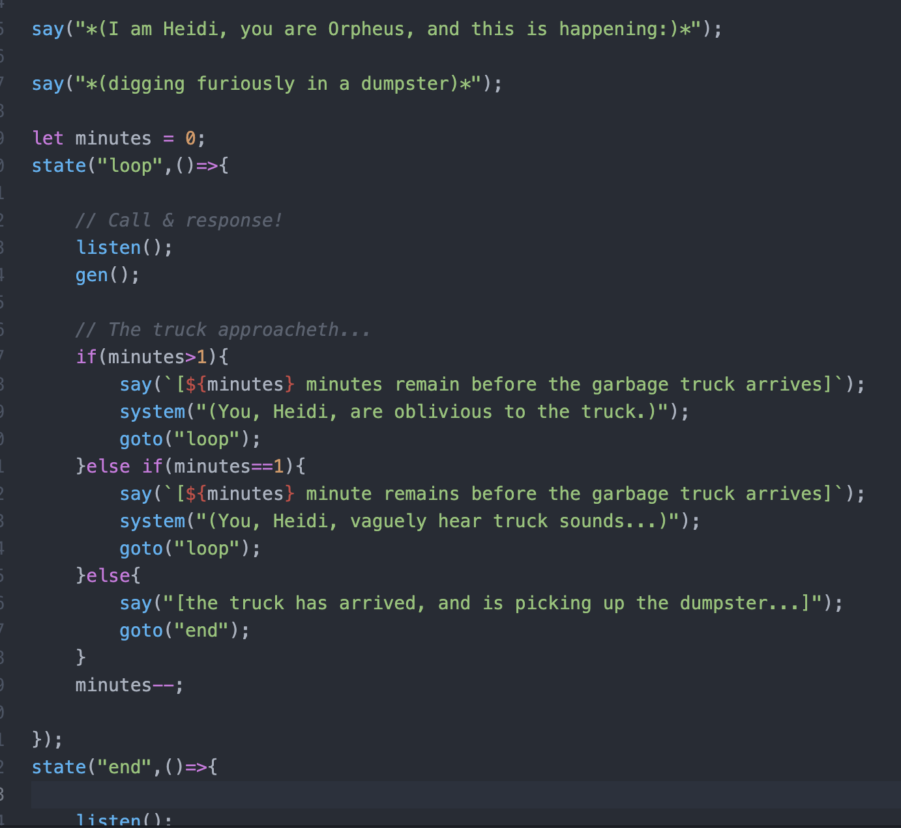

## This repo only has code samples, they can't be run by themselves

I'm putting this code up so that MATS mentors can see what code I've written using LLMs. However, it's not possible to create "unlisted" GitHub repos, and I don't want *ALL* my code to be online yet, so this repo only contains *some* of my LLM code.

For context: I'm making a tool called **Speakeasy** ([more notes](https://blog.ncase.me/research-notes-oct-2024/#project_3)), an accessible way to make narrow, hybrid AIs — combining the flexibility of LLMs with the verifiable interpretability of GOFAI!

*Eventually* I'd like Speakeasy to have a visual editor, so even laypeople can use it. For now, it uses a simplified script. For example, here's the code for a silly, LLM-driven text-adventure game (see `garbage-day.js` in this repo):

But Speakeasy can do serious work, too! I used it to help me prototype:

* **BEG: Bayesian Elicitation Generation.** ([more notes & demo video](https://blog.ncase.me/research-notes-oct-2024/#project_1), also see `beg.js`) a system to actively elicit a human's values in a qualitative *and* quantitative way.
* **SASS: Semi-automated AI Safety Scientist.** ([more notes](https://blog.ncase.me/research-notes-oct-2024/#project_2), also see `persuade.js`) First, I replicated a former MATS alum's work, showing that GPT-3.5 can infer your demographics (gender/race/etc) from *just a small non-personal essay*. Then, I used Speakeasy to *automatically generate & test* causal hypotheses on what features in one's writing style lets GPT-3.5 do that. (Concept-based black-box interp)

So those are the three code files in this repo. This repo does *not* contain the code for Speakeasy, coz I can't make "unlisted" repos, and c'mon, I'm still working on it and it's my special premature baby, gimme a break

**P.S:** Oh, also in the code it's called "Avocado" instead of Speakeasy because... well, I was hungry when I gave it a placeholder name.
